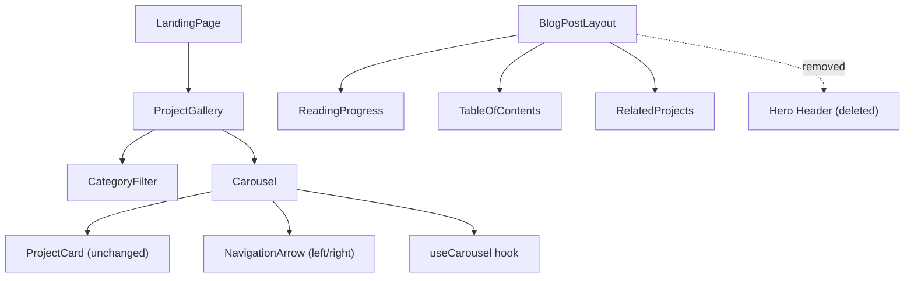

# Design Document: Carousel Gallery & Blog Cleanup

## Overview

This design covers three coordinated changes to the portfolio site:

1. Replace the CSS grid in `ProjectGallery` with a custom horizontal carousel built on native scroll + Framer Motion.
2. Remove the hero header section from `BlogPostLayout`.
3. Fix the invisible-but-clickable filtered cards bug by rendering only matching cards in the DOM (no hidden/zero-opacity cards).

The carousel is implemented without external carousel libraries to keep the bundle small. It uses CSS `overflow-x: auto` with `scroll-snap-type` for the scroll track, Framer Motion for entrance animations, and a `useCarousel` custom hook to encapsulate auto-scroll, pause-on-hover, arrow visibility, and keyboard navigation logic.

## Architecture



The key architectural decisions:

1. **New `Carousel` component** — A generic horizontal scroll container that wraps any children. It owns the scroll ref, arrow buttons, and delegates behavior to `useCarousel`.
2. **New `useCarousel` hook** — Encapsulates scroll state (position, canScrollLeft, canScrollRight), auto-scroll timer, pause-on-hover, keyboard arrow handling, and programmatic scroll-by-card-width.
3. **`ProjectCard` unchanged** — The card component interface stays identical. Only its parent container changes from grid to carousel.
4. **`BlogPostLayout` simplified** — The hero header JSX block is deleted. The component renders `<ReadingProgress />` followed directly by the content area.

## Components and Interfaces

### useCarousel Hook

```typescript
interface UseCarouselOptions {
  /** Auto-scroll interval in ms. 0 = disabled. Default: 4000 */
  autoScrollInterval?: number;
  /** Number of items currently displayed */
  itemCount: number;
}

interface UseCarouselReturn {
  /** Ref to attach to the scroll container */
  scrollRef: React.RefObject<HTMLDivElement>;
  /** Whether the container can scroll left */
  canScrollLeft: boolean;
  /** Whether the container can scroll right */
  canScrollRight: boolean;
  /** Scroll left by one card width */
  scrollPrev: () => void;
  /** Scroll right by one card width */
  scrollNext: () => void;
  /** Pause auto-scroll (call on mouseenter) */
  pauseAutoScroll: () => void;
  /** Resume auto-scroll (call on mouseleave) */
  resumeAutoScroll: () => void;
  /** Keyboard event handler for arrow key navigation */
  handleKeyDown: (e: React.KeyboardEvent) => void;
}
```

Implementation details:
- Uses `scrollRef.current.scrollBy({ left: cardWidth, behavior: 'smooth' })` for navigation.
- Card width is computed from the first child element's `offsetWidth + gap`.
- `canScrollLeft` / `canScrollRight` are derived from `scrollLeft`, `scrollWidth`, and `clientWidth`, updated via a `scroll` event listener.
- Auto-scroll uses `setInterval`. The interval is cleared on hover and re-created on mouse leave. Auto-scroll is disabled when `itemCount` fits within the visible area (i.e., `scrollWidth <= clientWidth`).
- Arrow keys (Left/Right) call `scrollPrev`/`scrollNext` when the carousel container has focus.

### Carousel Component

```tsx
interface CarouselProps {
  children: React.ReactNode;
  /** Number of items (used to determine auto-scroll behavior) */
  itemCount: number;
  /** Auto-scroll interval in ms. Default: 4000 */
  autoScrollInterval?: number;
  /** ARIA label for the carousel region */
  ariaLabel?: string;
}
```

Renders:
- A `<div role="region" aria-label={ariaLabel}>` wrapper.
- Left `NavigationArrow` (hidden when `!canScrollLeft`).
- A scroll container `<div>` with `overflow-x: auto`, `scroll-snap-type: x mandatory`, `flex`, `gap-6`, and `scroll-snap-align: start` on children.
- Right `NavigationArrow` (hidden when `!canScrollRight`).
- Scrollbar is hidden via `scrollbar-hide` utility (Tailwind plugin or custom CSS class using `-webkit-scrollbar` and `scrollbar-width: none`).

### NavigationArrow Component

```tsx
interface NavigationArrowProps {
  direction: 'left' | 'right';
  onClick: () => void;
  disabled: boolean;
}
```

Renders a `<button>` with:
- `aria-label="Scroll left"` or `"Scroll right"`
- `ChevronLeft` or `ChevronRight` icon from lucide-react
- Positioned absolutely on the carousel edges with `pointer-events-none` when disabled, opacity transition
- Uses Design_Token colors: `text-text-muted hover:text-accent bg-surface/80 backdrop-blur-sm border border-border/50`

### Updated ProjectGallery

The component changes:
- Replaces the `<motion.div className="grid ...">` with `<Carousel itemCount={filteredProjects.length}>`.
- Each `ProjectCard` is wrapped in a `<div>` with `min-w-[280px] sm:min-w-[320px] scroll-snap-align-start` to set card width and snap behavior.
- When `filteredProjects.length <= 3` (fits in viewport), cards are centered using `justify-center` on the flex container and auto-scroll is disabled.
- The `CategoryFilter` remains above the carousel, unchanged.

### Updated BlogPostLayout

Changes:
- Delete the entire `{/* Hero header */}` block (from `<div className="relative bg-gradient-to-br ...">` through its closing `</div>`).
- Remove unused imports: `Link`, `ArrowLeft`, `Clock`, `Calendar`, `Tag`, `staggerContainer`, `fadeUp`.
- Remove the `slug` and `project` variables that were only used by the hero header.
- The component now renders: `<ReadingProgress />` → content area with TOC and article.

## Data Models

No new data models are introduced. The existing `Project` interface and `projects` array remain unchanged:

```typescript
interface Project {
  slug: string;
  title: string;
  description: string;
  image: string;
  tags: string[];
  category: string;
}
```

The `CATEGORIES` constant and `Category` type remain unchanged. The `CategoryFilter` props interface is unchanged.


## Correctness Properties

*A property is a characteristic or behavior that should hold true across all valid executions of a system — essentially, a formal statement about what the system should do. Properties serve as the bridge between human-readable specifications and machine-verifiable correctness guarantees.*

### Property 1: Cards rendered in horizontal flex container

*For any* set of filtered projects, the Carousel scroll container SHALL use a flex layout (not grid), and every rendered ProjectCard SHALL be a direct child of that flex container in a single horizontal row.

**Validates: Requirements 1.1**

### Property 2: Card depth styling uses design tokens

*For any* rendered ProjectCard within the Carousel, the card wrapper SHALL contain shadow and border classes from the design token system (e.g., `shadow-glow`, `border-border`) and SHALL NOT contain hardcoded color values.

**Validates: Requirements 1.3, 8.1**

### Property 3: Arrow visibility matches scroll bounds

*For any* scroll position within the Carousel, the left Navigation_Arrow SHALL be hidden/disabled when `scrollLeft <= 0`, and the right Navigation_Arrow SHALL be hidden/disabled when `scrollLeft + clientWidth >= scrollWidth`. Conversely, each arrow SHALL be visible when its scroll direction has remaining content.

**Validates: Requirements 2.4, 2.5**

### Property 4: Auto-scroll disabled when items fit viewport

*For any* Carousel where `scrollWidth <= clientWidth` (all items fit without scrolling), auto-scroll SHALL be disabled. Equivalently, for any item count that fits within the visible area, the auto-scroll interval SHALL not be active.

**Validates: Requirements 3.4**

### Property 5: Category filtering correctness

*For any* category selection and any projects array, the Carousel SHALL display exactly the projects whose category matches the selection. When "All" is selected, the Carousel SHALL display every project. The filtering function `filter(projects, category)` SHALL satisfy: `result = category === 'All' ? projects : projects.filter(p => p.category === category)`.

**Validates: Requirements 4.2, 4.5**

### Property 6: Small result sets are centered

*For any* filtered result set with count less than or equal to the number of cards that fit in the viewport, the Carousel container SHALL apply centering styles (e.g., `justify-center`) so cards appear as a centered horizontal strip.

**Validates: Requirements 4.4**

### Property 7: BlogPostLayout renders children in article with prose styling

*For any* children content passed to BlogPostLayout, the content SHALL be rendered inside an `<article>` element that has the `prose` CSS class.

**Validates: Requirements 5.3**

### Property 8: No invisible clickable cards after filtering

*For any* category filter state, every `<a>` link element within the Carousel SHALL be visible (no ancestor with `opacity: 0`, `visibility: hidden`, or `display: none`). The number of link elements SHALL equal the number of projects matching the active filter.

**Validates: Requirements 6.1, 6.2**

## Error Handling

| Scenario | Handling |
|---|---|
| Zero projects match a category filter | Carousel renders empty. No arrows shown. Auto-scroll disabled. Optionally show "No projects in this category" message. |
| Image fails to load in ProjectCard | Existing behavior: image stays at `opacity-0`, `bg-surface` placeholder remains visible. No change needed. |
| `scrollRef.current` is null (e.g., during SSR or unmount) | `useCarousel` guards all `scrollRef.current` accesses with null checks. Arrow state defaults to `canScrollLeft: false, canScrollRight: false`. |
| Browser doesn't support `scroll-snap-type` | Graceful degradation: carousel still scrolls horizontally, just without snap points. No JS fallback needed. |
| `window.matchMedia` unavailable | `useReducedMotion` from Framer Motion handles this internally. Auto-scroll still functions. |

## Testing Strategy

### Testing Framework

- **Unit/integration tests**: Vitest + React Testing Library (existing setup)
- **Property-based tests**: fast-check (existing setup)
- **Test command**: `npx vitest run`

### Dual Testing Approach

**Unit tests** cover:
- Carousel renders navigation arrows with correct aria-labels (Req 2.1, 2.6)
- Carousel container has `role="region"` and `aria-label` (Req 7.1)
- BlogPostLayout no longer renders hero header elements (Req 5.1)
- BlogPostLayout retains ReadingProgress, TOC, article, RelatedProjects (Req 5.2)
- CategoryFilter renders above carousel (Req 4.1)
- Filter change resets scroll position (Req 4.3)
- Auto-scroll pauses on hover, resumes on mouse leave (Req 3.2, 3.3)
- Keyboard arrow keys trigger scroll handlers (Req 7.3)

**Property-based tests** cover:
- Property 1: Horizontal flex layout (Req 1.1)
- Property 2: Design token styling (Req 1.3, 8.1)
- Property 3: Arrow visibility vs scroll bounds (Req 2.4, 2.5)
- Property 4: Auto-scroll disabled for small sets (Req 3.4)
- Property 5: Category filtering correctness (Req 4.2, 4.5)
- Property 6: Small result centering (Req 4.4)
- Property 7: BlogPostLayout children in prose article (Req 5.3)
- Property 8: No invisible clickable cards (Req 6.1, 6.2)

### Property-Based Testing Configuration

- Library: `fast-check`
- Minimum iterations: 100 per property
- Each test tagged with: **Feature: carousel-gallery-blog-cleanup, Property {N}: {title}**
- Each correctness property implemented as a single property-based test
- Reuse the existing `projectArb` arbitrary from `ProjectGallery.property.test.tsx`

### Test File Changes

| File | Action |
|---|---|
| `src/components/ProjectGallery.test.tsx` | Update: replace grid layout assertions with carousel structure assertions. Update filter tests to check carousel content. |
| `src/components/ProjectGallery.property.test.tsx` | Update: replace grid/uniform-layout properties with carousel properties (Properties 1, 2, 5, 6, 8). Keep existing tag display and card link properties. |
| `src/components/BlogPostLayout.test.tsx` | Update: remove test for "back to projects" link. Add test confirming hero header is absent. Keep all other tests. |
| `src/hooks/useCarousel.test.ts` | New: unit tests for hook logic (arrow visibility, auto-scroll enable/disable). Property tests for Properties 3 and 4. |
| `src/components/CategoryFilter.test.tsx` | No changes needed. |
| `src/pages/LandingPage.test.tsx` | No changes needed (ProjectGallery is still composed the same way). |
