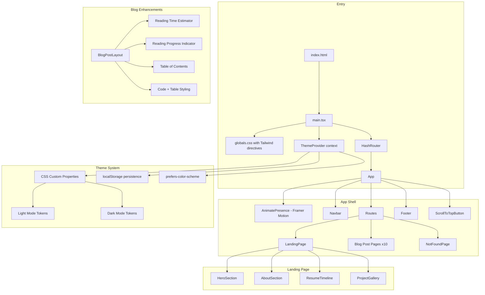

# Design Document: Portfolio UI Redesign

## Overview

This design describes the comprehensive visual overhaul of henrylam.blog from its legacy Bootstrap/fh5co template to a modern Tailwind CSS-based design system. The redesign touches every visual component while preserving the existing React SPA architecture (Vite + TypeScript + React Router HashRouter), all 10 blog posts, routing, GA4 analytics, and the 169-test suite.

The approach is incremental: first establish the foundational layer (Tailwind, design tokens, theme provider, typography), then restyle each component top-to-bottom, and finally add enhancement layers (page transitions, blog reading aids). This order minimizes broken intermediate states.

### Key Design Decisions

1. **Tailwind CSS v3 via PostCSS** — installed as a dev dependency with PostCSS integration in Vite, not a CDN. This enables tree-shaking, custom theme extension, and dark mode via the `class` strategy.
2. **CSS custom properties for design tokens** — Tailwind's theme is extended to reference CSS variables, allowing runtime theme switching without rebuilding.
3. **Framer Motion for animations** — page transitions and scroll-triggered animations replace the legacy `animate.css` + jQuery Waypoints approach.
4. **Lucide React for icons** — replaces Icomoon icon font with tree-shakeable SVG icons.
5. **Inter + Plus Jakarta Sans font pairing** — Inter for body text (clean, highly legible), Plus Jakarta Sans for headings (modern geometric feel). Both from Google Fonts.

## Architecture



### File Structure Changes

```
src/
├── main.tsx                    # Updated: import globals.css, wrap with ThemeProvider
├── App.tsx                     # Updated: wrap Routes in AnimatePresence
├── globals.css                 # NEW: Tailwind directives + CSS custom properties
├── contexts/
│   └── ThemeContext.tsx         # NEW: Theme provider + hook
├── components/
│   ├── Navbar.tsx              # RESTYLE: consistent nav, scroll bg, theme toggle
│   ├── HeroSection.tsx         # RESTYLE: gradient overlay, fewer descriptors
│   ├── AboutSection.tsx        # RESTYLE: structured layout, skill chips
│   ├── ResumeTimeline.tsx      # RESTYLE: single-column cards
│   ├── ProjectGallery.tsx      # RESTYLE: visible titles, tags, category filter
│   ├── BlogPostLayout.tsx      # RESTYLE: reading aids, content styling
│   ├── RelatedProjects.tsx     # RESTYLE: Tailwind card layout
│   ├── Footer.tsx              # RESTYLE: social links, CTA
│   ├── ScrollToTopButton.tsx   # RESTYLE: Tailwind + Lucide icon
│   ├── PageTransition.tsx      # NEW: Framer Motion wrapper
│   ├── ReadingProgress.tsx     # NEW: scroll progress bar
│   ├── TableOfContents.tsx     # NEW: heading-based TOC
│   ├── CategoryFilter.tsx      # NEW: project filter pills
│   ├── ThemeToggle.tsx         # NEW: light/dark toggle button
│   ├── PageLoader.tsx          # RESTYLE
│   ├── ErrorBoundary.tsx       # UNCHANGED
│   ├── ScrollToTop.tsx         # UNCHANGED
│   └── TypedTextAnimator.tsx   # UNCHANGED (logic preserved)
├── hooks/
│   ├── useScrollAnimation.ts   # UPDATED: use Framer Motion instead of CSS classes
│   ├── useReadingProgress.ts   # NEW: scroll percentage hook
│   └── useTableOfContents.ts   # NEW: heading extraction hook
├── pages/
│   ├── LandingPage.tsx         # RESTYLE
│   ├── NotFoundPage.tsx        # RESTYLE
│   └── blog/                   # RESTYLE: all 10 blog posts get new layout wrapper
└── test/
    └── setup.ts                # UPDATED: mock matchMedia for dark mode tests
```

## Components and Interfaces

### ThemeContext (NEW)

```typescript
// src/contexts/ThemeContext.tsx
type Theme = 'light' | 'dark';

interface ThemeContextValue {
  theme: Theme;
  toggleTheme: () => void;
}

// Provider wraps the app in main.tsx, above HashRouter
// Reads initial value: localStorage → prefers-color-scheme → 'light'
// On toggle: flips theme, persists to localStorage, toggles 'dark' class on <html>
// Tailwind dark mode uses class strategy: <html class="dark">
```

### ThemeToggle (NEW)

```typescript
// src/components/ThemeToggle.tsx
// Renders a button with sun/moon Lucide icon
// Calls toggleTheme from ThemeContext on click
// Accessible: aria-label="Switch to dark/light mode"
```

### Navbar (RESTYLE)

```typescript
// src/components/Navbar.tsx
// Remove variant prop logic (no more landing vs blog switching)
// Single consistent style:
//   - Transparent bg on landing when scrollY < hero height
//   - Solid bg (bg-white dark:bg-gray-900) otherwise and on all blog pages
//   - Transition: transition-colors duration-300
// Contains: brand name (Inter heading font), nav links, ThemeToggle
// Mobile: hamburger menu using state toggle, Tailwind responsive classes
// Navigation logic preserved: handleNavClick for section scrolling
```

### HeroSection (RESTYLE)

```typescript
// src/components/HeroSection.tsx
// Full viewport height: h-screen
// Background: cover image with gradient overlay
//   background: linear-gradient(to bottom, rgba(0,0,0,0.3), rgba(0,0,0,0.6))
//   replaces the solid orange .overlay div
// Profile photo: rounded-2xl with ring-4 ring-white/20 shadow-2xl
// Name: text-5xl font-heading (Plus Jakarta Sans)
// Typed text: 3-4 descriptors instead of 20
//   e.g., ["Software Engineer", "AI Enthusiast", "Creative Builder"]
// Scroll indicator: animated chevron-down icon at bottom
// TypedTextAnimator component logic unchanged, just fewer strings passed
```

### AboutSection (RESTYLE)

```typescript
// src/components/AboutSection.tsx
// Two-column on desktop (md:grid-cols-2), single column on mobile
// Left column: bio text with clear paragraph spacing
// Right column: skill chips grouped by category
//   interface SkillCategory { name: string; skills: string[] }
//   Rendered as: category heading + flex-wrap container of pill-shaped tags
//   Tags use accent colors from Color_System
// Contact info (name, email) integrated into bio column, not a separate list
```

### ResumeTimeline (RESTYLE)

```typescript
// src/components/ResumeTimeline.tsx
// Single-column layout (remove alternating left-right)
// Each entry: card with left border accent color
//   - Education: primary color border
//   - Work: secondary color border
// Card content: title, organization, date range, optional description
// Icon badges: Lucide icons (GraduationCap, Briefcase) in colored circles
// Section headings: "Education" and "Work Experience" with horizontal rule
// TimelineItem interface unchanged
// TimelineEntry component restyled with Tailwind
```

### ProjectGallery (RESTYLE)

```typescript
// src/components/ProjectGallery.tsx
// Extended Project interface:
export interface Project {
  slug: string;
  title: string;
  description: string;
  image: string;
  tags: string[];       // NEW: e.g., ["Python", "TensorFlow"]
  category: string;     // NEW: e.g., "AI/ML", "Games", "Hardware", "Web", "Blockchain"
}

// CategoryFilter: horizontal scrollable pill buttons
//   "All" | "AI/ML" | "Games" | "Hardware" | "Web" | "Blockchain"
//   Active pill gets accent bg, others get neutral bg
//   State: selectedCategory in ProjectGallery component

// Project cards:
//   - Image at top with aspect-video
//   - Title and description always visible below image
//   - Tech stack tags as small pills at bottom of card
//   - Hover: subtle scale + shadow transition
//   - Click navigates to blog post via Link

// Grid: grid-cols-1 md:grid-cols-2 lg:grid-cols-3 gap-6
// Filtering: projects.filter(p => selected === 'All' || p.category === selected)
```

### CategoryFilter (NEW)

```typescript
// src/components/CategoryFilter.tsx
interface CategoryFilterProps {
  categories: string[];
  selected: string;
  onSelect: (category: string) => void;
}
// Renders horizontal list of pill buttons
// "All" is always the first option
// Accessible: role="tablist" with role="tab" on each pill
```

### BlogPostLayout (RESTYLE)

```typescript
// src/components/BlogPostLayout.tsx
// Wraps blog content with reading enhancements:
//   - ReadingProgress bar at top (fixed position)
//   - Reading time estimate below the post title
//   - TableOfContents sidebar (sticky on desktop, collapsible on mobile)
//   - Styled prose content using Tailwind Typography plugin (@tailwindcss/typography)
//     - Code blocks: bg-gray-100 dark:bg-gray-800, rounded, padded, monospace font
//     - Tables: border, striped rows, horizontal scroll wrapper on mobile
//   - RelatedProjects at bottom
```

### ReadingProgress (NEW)

```typescript
// src/components/ReadingProgress.tsx
// Fixed bar at top of viewport, height 3px
// Width = scroll percentage from useReadingProgress hook
// Color: accent from Color_System
// Only rendered on blog post pages
```

### TableOfContents (NEW)

```typescript
// src/components/TableOfContents.tsx
interface TOCItem {
  id: string;
  text: string;
  level: number; // 2 for h2, 3 for h3
}

interface TableOfContentsProps {
  items: TOCItem[];
}
// Renders nested list of heading links
// Click scrolls to heading smoothly
// Desktop: sticky sidebar
// Mobile: collapsible disclosure widget
```

### PageTransition (NEW)

```typescript
// src/components/PageTransition.tsx
// Wraps page content with Framer Motion
// Uses AnimatePresence in App.tsx with location key
// Animation: fade + slight translateY
//   initial={{ opacity: 0, y: 8 }}
//   animate={{ opacity: 1, y: 0 }}
//   exit={{ opacity: 0, y: -8 }}
//   transition={{ duration: 0.3 }}
```

### Footer (RESTYLE)

```typescript
// src/components/Footer.tsx
// "Let's Connect" heading
// Social links: GitHub, LinkedIn, Email
//   Lucide icons (Github, Linkedin, Mail)
//   target="_blank" rel="noopener noreferrer"
//   aria-label on each link
// Copyright: © {currentYear} henrylam.blog
// Styled with Color_System tokens, dark mode aware
```

### ScrollToTopButton (RESTYLE)

```typescript
// src/components/ScrollToTopButton.tsx
// Replace Icomoon icon with Lucide ArrowUp
// Tailwind styling: fixed bottom-6 right-6, rounded-full, shadow
// Fade in/out with opacity transition
// Existing scroll logic preserved (visible when scrollY > 200)
```

### Hooks

#### useReadingProgress (NEW)

```typescript
// src/hooks/useReadingProgress.ts
// Returns a number 0-100 representing scroll percentage through the content
// Calculates: (scrollY / (documentHeight - viewportHeight)) * 100
// Clamped to 0-100
// Uses passive scroll listener
// Pure calculation function exported for testing:
export function calculateReadingProgress(
  scrollY: number,
  documentHeight: number,
  viewportHeight: number
): number;
```

#### useTableOfContents (NEW)

```typescript
// src/hooks/useTableOfContents.ts
// Accepts a ref to the content container
// Queries for h2, h3 elements within the container
// Returns TOCItem[] with id, text, level
// Ensures each heading has an id (generates one from text if missing)
// Pure extraction function exported for testing:
export function extractHeadings(
  headings: { tagName: string; id: string; textContent: string }[]
): TOCItem[];
```

#### useScrollAnimation (UPDATED)

```typescript
// src/hooks/useScrollAnimation.ts
// Core IntersectionObserver logic preserved
// Replace animate.css class application with Tailwind + Framer Motion classes
// processAnimationEntries and applyAnimation functions updated
```

## Data Models

### Design Tokens (CSS Custom Properties)

```css
/* src/globals.css */
@tailwind base;
@tailwind components;
@tailwind utilities;

@layer base {
  :root {
    /* Primary: deep blue-gray */
    --color-primary: 30 41 59;        /* slate-800 */
    --color-primary-light: 71 85 105; /* slate-600 */

    /* Secondary: warm gray */
    --color-secondary: 120 113 108;   /* stone-500 */

    /* Accent: refined orange (preserved from original) */
    --color-accent: 249 115 22;       /* orange-500 */
    --color-accent-light: 251 146 60; /* orange-400 */

    /* Neutral */
    --color-bg: 255 255 255;
    --color-surface: 248 250 252;     /* slate-50 */
    --color-text: 15 23 42;           /* slate-900 */
    --color-text-muted: 100 116 139;  /* slate-500 */
    --color-border: 226 232 240;      /* slate-200 */

    /* Semantic */
    --color-success: 34 197 94;
    --color-warning: 234 179 8;
    --color-error: 239 68 68;
  }

  .dark {
    --color-primary: 148 163 184;     /* slate-400 */
    --color-primary-light: 203 213 225; /* slate-300 */

    --color-secondary: 168 162 158;   /* stone-400 */

    --color-accent: 251 146 60;       /* orange-400 */
    --color-accent-light: 253 186 116; /* orange-300 */

    --color-bg: 15 23 42;             /* slate-900 */
    --color-surface: 30 41 59;        /* slate-800 */
    --color-text: 241 245 249;        /* slate-100 */
    --color-text-muted: 148 163 184;  /* slate-400 */
    --color-border: 51 65 85;         /* slate-700 */

    --color-success: 74 222 128;
    --color-warning: 250 204 21;
    --color-error: 248 113 113;
  }
}
```

### Tailwind Configuration Extension

```typescript
// tailwind.config.ts
export default {
  content: ['./index.html', './src/**/*.{ts,tsx}'],
  darkMode: 'class',
  theme: {
    extend: {
      colors: {
        primary: 'rgb(var(--color-primary) / <alpha-value>)',
        'primary-light': 'rgb(var(--color-primary-light) / <alpha-value>)',
        secondary: 'rgb(var(--color-secondary) / <alpha-value>)',
        accent: 'rgb(var(--color-accent) / <alpha-value>)',
        'accent-light': 'rgb(var(--color-accent-light) / <alpha-value>)',
        bg: 'rgb(var(--color-bg) / <alpha-value>)',
        surface: 'rgb(var(--color-surface) / <alpha-value>)',
        'text-primary': 'rgb(var(--color-text) / <alpha-value>)',
        'text-muted': 'rgb(var(--color-text-muted) / <alpha-value>)',
        border: 'rgb(var(--color-border) / <alpha-value>)',
      },
      fontFamily: {
        sans: ['Inter', 'system-ui', 'sans-serif'],
        heading: ['"Plus Jakarta Sans"', 'system-ui', 'sans-serif'],
      },
    },
  },
  plugins: [require('@tailwindcss/typography')],
};
```

### Extended Project Data Model

```typescript
// Updated projects array in ProjectGallery.tsx
export interface Project {
  slug: string;
  title: string;
  description: string;
  image: string;
  tags: string[];
  category: string;
}

export const CATEGORIES = ['All', 'AI/ML', 'Games', 'Hardware', 'Web', 'Blockchain'] as const;
export type Category = typeof CATEGORIES[number];

export const projects: Project[] = [
  {
    slug: 'wordle-solver',
    title: 'Wordle Solver',
    description: 'Greedy Search Algorithm',
    image: '/images/wordle.jpg',
    tags: ['Python', 'Algorithms'],
    category: 'AI/ML',
  },
  {
    slug: 'immersive-ball-shooter',
    title: 'Immersive Ball Shooter',
    description: 'Apple Vision Pro',
    image: '/images/ball_shooter.png',
    tags: ['Swift', 'ARKit', 'RealityKit'],
    category: 'Games',
  },
  // ... remaining projects with tags and categories
];
```

### Theme State Model

```typescript
type Theme = 'light' | 'dark';

interface ThemeState {
  theme: Theme;
  source: 'localStorage' | 'os-preference' | 'default';
}
```

### TOC Item Model

```typescript
interface TOCItem {
  id: string;
  text: string;
  level: number; // 2 or 3
}
```

## Correctness Properties

*A property is a characteristic or behavior that should hold true across all valid executions of a system — essentially, a formal statement about what the system should do. Properties serve as the bridge between human-readable specifications and machine-verifiable correctness guarantees.*

### Property 1: Theme toggle is an involution

*For any* current theme value (light or dark), toggling the theme twice should return to the original theme value. Formally: `toggle(toggle(theme)) === theme`.

**Validates: Requirements 3.2**

### Property 2: Theme persistence round-trip

*For any* valid theme value written to localStorage, initializing the ThemeProvider should read back that same theme value. Formally: `initTheme(writeTheme(theme)) === theme`.

**Validates: Requirements 3.4**

### Property 3: Navbar renders consistent base structure across all routes

*For any* route path in the application (landing page or any of the 10 blog post routes), the Navbar should render the same set of navigation links and the theme toggle control.

**Validates: Requirements 5.1**

### Property 4: Timeline entries receive type-appropriate styling

*For any* TimelineItem, if its type is 'education' the rendered entry should include the education icon and primary color accent, and if its type is 'work' it should include the work icon and secondary color accent. The two types should never share the same icon or accent.

**Validates: Requirements 8.2**

### Property 5: Project tags are displayed on cards

*For any* project in the projects array that has a non-empty tags array, the rendered ProjectCard should contain text matching each tag string.

**Validates: Requirements 9.2**

### Property 6: Category filtering returns only matching projects

*For any* category selection and any projects array, filtering by that category should return only projects whose category field matches the selection. When "All" is selected, all projects should be returned.

**Validates: Requirements 9.4, 9.5**

### Property 7: Project card links match slugs

*For any* project in the projects array, the rendered ProjectCard should contain a link whose href ends with the project's slug.

**Validates: Requirements 9.7**

### Property 8: Reading time calculation is proportional to word count

*For any* non-negative word count, the reading time estimate should equal `Math.ceil(wordCount / 200)` (assuming 200 words per minute), with a minimum of 1 minute. The function should be monotonically non-decreasing: more words should never produce a shorter reading time.

**Validates: Requirements 10.1**

### Property 9: Reading progress calculation is bounded and monotonic

*For any* valid scrollY (≥ 0), documentHeight (> 0), and viewportHeight (> 0 and ≤ documentHeight), the reading progress percentage should be between 0 and 100 inclusive. For a fixed document and viewport height, increasing scrollY should produce a non-decreasing progress value.

**Validates: Requirements 10.2**

### Property 10: Table of contents extraction preserves heading order and content

*For any* array of heading elements (h2, h3) in document order, the extracted TOC items should maintain the same order, each item's text should match the heading's text content, and each item's level should correspond to the heading tag number.

**Validates: Requirements 10.3**

### Property 11: Social links have correct accessibility and security attributes

*For any* social link rendered in the Footer, the link element should have a non-empty `aria-label`, `target="_blank"`, and `rel` containing both "noopener" and "noreferrer".

**Validates: Requirements 12.1, 12.4**

### Property 12: Scroll-to-top visibility tracks scroll position

*For any* scrollY value, the Scroll_To_Top_Button should be visible if and only if scrollY > 200.

**Validates: Requirements 13.1, 13.2**

### Property 13: All blog routes map to valid components

*For any* blog route in the blogRoutes configuration, the slug should be a non-empty string and the component should be a valid React component (not null or undefined).

**Validates: Requirements 14.1**

### Property 14: All project images reference existing paths

*For any* project in the projects array, the image path should start with `/images/` and reference a file that exists in the `public/images/` directory.

**Validates: Requirements 14.4**

## Error Handling

### Theme Provider Errors

- **localStorage unavailable**: Wrap `localStorage.getItem`/`setItem` in try-catch. On read failure, fall back to OS preference via `window.matchMedia('(prefers-color-scheme: dark)')`. On write failure, continue operating with in-memory theme state only.
- **Invalid stored value**: If localStorage contains a value other than 'light' or 'dark', treat it as missing and fall back to OS preference.
- **matchMedia unavailable**: If `window.matchMedia` is not available (e.g., SSR or old browser), default to 'light'.

### Reading Progress Edge Cases

- **Document shorter than viewport**: When `documentHeight <= viewportHeight`, progress should be 100 (content fully visible).
- **Zero scroll height**: Clamp to 0 to avoid division by zero.

### Table of Contents Edge Cases

- **Fewer than 2 headings**: Do not render the TOC component (per requirement 10.3).
- **Headings without IDs**: Generate a slug from the heading text content (lowercase, replace spaces with hyphens, strip non-alphanumeric).
- **Duplicate heading IDs**: Append a numeric suffix to ensure uniqueness.

### Category Filter Edge Cases

- **No projects match category**: Display an empty state message ("No projects in this category").
- **Projects array is empty**: Display the filter but show empty state.

### Page Transition Errors

- **Framer Motion animation failure**: AnimatePresence handles cleanup automatically. If a component unmounts during animation, Framer Motion's exit animation is skipped gracefully.

### Image Loading Errors

- **Missing project images**: ProjectCard should handle `onError` on the `` element and display a placeholder or fallback background color.

## Testing Strategy

### Testing Framework

- **Unit/Integration tests**: Vitest + React Testing Library (existing setup preserved)
- **Property-based tests**: fast-check (already in devDependencies)
- **Test environment**: jsdom (existing setup preserved)

### Dual Testing Approach

Unit tests and property-based tests are complementary:
- **Unit tests** verify specific examples, edge cases, integration points, and DOM rendering
- **Property tests** verify universal properties across randomly generated inputs

### Property-Based Testing Configuration

- Library: `fast-check` (already installed, v4.1.1)
- Minimum 100 iterations per property test
- Each property test tagged with: **Feature: portfolio-ui-redesign, Property {N}: {title}**
- Each correctness property implemented as a single property-based test

### Test Organization

Property tests are co-located with their component/hook files:
- `src/contexts/ThemeContext.property.test.ts` — Properties 1, 2
- `src/components/Navbar.property.test.tsx` — Property 3
- `src/components/ResumeTimeline.property.test.tsx` — Property 4 (update existing)
- `src/components/ProjectGallery.property.test.tsx` — Properties 5, 6, 7 (update existing)
- `src/hooks/useReadingProgress.property.test.ts` — Properties 8, 9
- `src/hooks/useTableOfContents.property.test.ts` — Property 10
- `src/components/Footer.property.test.tsx` — Property 11
- `src/components/ScrollToTopButton.property.test.ts` — Property 12
- `src/App.property.test.ts` — Properties 13, 14 (update existing)

### Unit Test Updates

All existing 22 test files need updates to reflect new markup (Tailwind classes instead of Bootstrap classes, new DOM structure). The test assertions should be updated to match the new component output while preserving the behavioral intent of each test.

### Test Setup Updates

`src/test/setup.ts` needs:
- Mock for `window.matchMedia` (for dark mode / OS preference detection)
- Existing `IntersectionObserver` mock preserved
