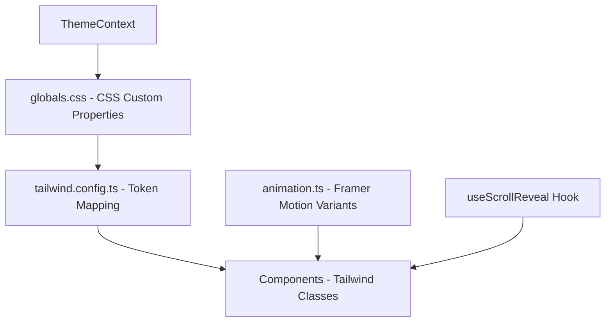

# Design Document: Portfolio Visual Redesign

## Overview

This design covers a complete visual overhaul of the henrylam.blog portfolio site. The redesign replaces the current cyan/teal dark-first aesthetic with a warm, orange-anchored palette, upgraded typography, and rich Framer Motion animations throughout. The existing React + Tailwind CSS + Vite + Framer Motion stack is preserved — the changes are purely visual and interaction-focused.

The approach modifies the existing Design Token System (CSS custom properties consumed by Tailwind), replaces font families, introduces new Framer Motion animation variants and hooks, and updates every component's styling to match the new visual identity.

## Architecture

The redesign touches three architectural layers:

1. **Token Layer** — CSS custom properties in `globals.css` and Tailwind config in `tailwind.config.ts`
2. **Animation Layer** — Framer Motion variants, a new `useScrollReveal` hook (replacing `useScrollAnimation`), and page transition config
3. **Component Layer** — Updated Tailwind classes and Framer Motion props across all components



### Key Design Decisions

1. **CSS custom properties over Tailwind theme values** — Keeps runtime theme switching fast (swap class on `<html>`, all tokens update). This is the existing pattern and works well.
2. **Framer Motion for all animations** — The project already uses Framer Motion. We'll use it consistently rather than mixing Tailwind keyframes and Framer Motion. Tailwind `transition-*` utilities are still used for simple hover/focus states.
3. **Centralized animation variants** — A single `src/lib/animation.ts` file defines all reusable Framer Motion variants. Components import from here rather than defining inline variants.
4. **Replace `useScrollAnimation` with `useScrollReveal`** — The current hook uses Intersection Observer + Tailwind class toggling. The new hook will use Framer Motion's `useInView` for consistency and simpler code. The old hook's pure functions (`processAnimationEntries`, `applyAnimation`) are no longer needed.

## Components and Interfaces

### Token Layer

#### `src/globals.css` — Color Tokens

```css
:root {
  /* Primary: warm orange */
  --color-primary: 245 124 0;        /* hsl(30, 100%, 48%) */
  --color-primary-light: 251 163 60; /* lighter orange */

  /* Secondary tones */
  --color-secondary: 194 120 86;     /* muted terracotta */
  --color-accent: 245 124 0;         /* same as primary — orange IS the accent */
  --color-accent-light: 251 163 60;

  /* Light mode: warm cream base */
  --color-bg: 255 252 247;           /* warm off-white */
  --color-surface: 250 245 237;      /* cream surface */
  --color-text: 28 25 23;            /* warm near-black */
  --color-text-muted: 120 110 100;   /* warm gray */
  --color-border: 230 222 210;       /* warm border */

  /* Semantic */
  --color-success: 34 197 94;
  --color-warning: 234 179 8;
  --color-error: 239 68 68;
}

.dark {
  /* Primary: bright orange for dark bg */
  --color-primary: 251 146 60;
  --color-primary-light: 253 186 116;

  --color-secondary: 168 130 100;
  --color-accent: 251 146 60;
  --color-accent-light: 253 186 116;

  /* Dark mode: deep warm charcoal */
  --color-bg: 18 16 14;
  --color-surface: 30 27 24;
  --color-text: 245 240 235;
  --color-text-muted: 160 150 140;
  --color-border: 55 48 42;

  --color-success: 74 222 128;
  --color-warning: 250 204 21;
  --color-error: 248 113 113;
}
```

#### `tailwind.config.ts` — Updated Config

Key changes:
- Font families updated (heading: `"Cabinet Grotesk"`, body: `"Inter"`, mono: `"JetBrains Mono"`)
- Box shadows updated to use orange glow instead of cyan
- New animation keyframes for gradient shift and pulse-glow
- Easing curve constant: `cubic-bezier(0.16, 1, 0.3, 1)` (used as `ease-out-expo`)

```ts
fontFamily: {
  sans: ['Inter', 'system-ui', 'sans-serif'],
  heading: ['"Cabinet Grotesk"', 'system-ui', 'sans-serif'],
  mono: ['"JetBrains Mono"', 'monospace'],
},
boxShadow: {
  glow: '0 0 20px rgba(245, 124, 0, 0.25)',
  'glow-lg': '0 0 40px rgba(245, 124, 0, 0.35)',
},
```

### Animation Layer

#### `src/lib/animation.ts` — Centralized Framer Motion Variants


```ts
import type { Variants, Transition } from 'framer-motion';

// Shared easing curve used across all animations
export const EASE_OUT_EXPO: number[] = [0.16, 1, 0.3, 1];

// Default transition preset
export const defaultTransition: Transition = {
  duration: 0.5,
  ease: EASE_OUT_EXPO,
};

// --- Scroll-triggered entrance variants ---

export const fadeUp: Variants = {
  hidden: { opacity: 0, y: 24 },
  visible: { opacity: 1, y: 0, transition: defaultTransition },
};

export const fadeIn: Variants = {
  hidden: { opacity: 0 },
  visible: { opacity: 1, transition: defaultTransition },
};

export const scaleIn: Variants = {
  hidden: { opacity: 0, scale: 0.95 },
  visible: { opacity: 1, scale: 1, transition: defaultTransition },
};

export const slideInLeft: Variants = {
  hidden: { opacity: 0, x: -24 },
  visible: { opacity: 1, x: 0, transition: defaultTransition },
};

export const slideInRight: Variants = {
  hidden: { opacity: 0, x: 24 },
  visible: { opacity: 1, x: 0, transition: defaultTransition },
};

// --- Stagger container ---

export const staggerContainer: Variants = {
  hidden: {},
  visible: {
    transition: {
      staggerChildren: 0.1,
      delayChildren: 0.05,
    },
  },
};

// --- Page transitions ---

export const pageTransition: Variants = {
  initial: { opacity: 0, y: 16 },
  animate: { opacity: 1, y: 0, transition: { duration: 0.35, ease: EASE_OUT_EXPO } },
  exit: { opacity: 0, y: -16, transition: { duration: 0.2, ease: 'easeIn' } },
};

// --- Micro-interaction variants ---

export const hoverScale = {
  scale: 1.03,
  transition: { duration: 0.2, ease: EASE_OUT_EXPO },
};

export const tapScale = {
  scale: 0.97,
  transition: { duration: 0.1 },
};

export const navUnderline: Variants = {
  rest: { scaleX: 0, originX: 0 },
  hover: { scaleX: 1, transition: { duration: 0.25, ease: EASE_OUT_EXPO } },
};
```

#### `src/hooks/useScrollReveal.ts` — Scroll-Triggered Animation Hook

Replaces the existing `useScrollAnimation` hook. Uses Framer Motion's `useInView` internally.

```ts
interface UseScrollRevealOptions {
  once?: boolean;       // default: true — animate only once
  amount?: number;      // default: 0.15 — viewport intersection threshold
  reducedMotion?: boolean; // auto-detected from prefers-reduced-motion
}

function useScrollReveal(options?: UseScrollRevealOptions): {
  ref: React.RefObject<HTMLElement>;
  isInView: boolean;
}
```

Components use it like:
```tsx
const { ref, isInView } = useScrollReveal();
return (
  <motion.section
    ref={ref}
    variants={staggerContainer}
    initial="hidden"
    animate={isInView ? 'visible' : 'hidden'}
  >
    <motion.div variants={fadeUp}>...</motion.div>
  </motion.section>
);
```

### Component Layer

#### HeroSection

- Background: subtle animated gradient mesh using orange/amber tones (Framer Motion `animate` on opacity/position)
- Profile photo: `rounded-2xl` with `ring-4 ring-accent/30` and animated glow pulse
- Name: staggered fade-up with `font-heading` (Cabinet Grotesk)
- Subtitle: fade-up with delay after name
- Scroll indicator: `motion.div` with `animate={{ y: [0, 8, 0] }}` infinite loop

#### Navbar

- Desktop links: each link has a `motion.span` underline using `navUnderline` variants on hover
- Scroll behavior: `motion.nav` with `animate` toggling between transparent and solid bg based on scroll position
- Mobile menu: `AnimatePresence` + `motion.div` with slide-down variant
- Hamburger icon: `motion.div` with rotation transition between Menu and X icons

#### AboutSection

- Container uses `useScrollReveal` + `staggerContainer`
- Bio paragraphs: `fadeUp` variants with stagger
- Skill category groups: `fadeUp` with stagger
- Individual skill chips: `scaleIn` with stagger within each group
- Skill chip hover: `whileHover={{ scale: 1.05 }}` with accent border highlight

#### ProjectGallery

- Section uses `useScrollReveal` + `staggerContainer`
- Cards: `fadeUp` with stagger
- Card hover: `whileHover={hoverScale}` + shadow elevation via Tailwind `hover:shadow-glow`
- Card tap: `whileTap={tapScale}`
- Tag reveal on hover: `motion.div` with `fadeIn` variant inside each card
- Category filter: `motion.div` with `layoutId="activeTab"` for the sliding pill indicator
- Filter change: `AnimatePresence mode="popLayout"` + `layout` prop on cards for smooth reflow

#### CategoryFilter

- Active tab indicator: `motion.div` with `layoutId="category-pill"` that slides between tabs
- Tab text: color transition via Tailwind `transition-colors`

#### BlogPostLayout

- Title + metadata: `staggerContainer` + `fadeUp` on load
- Content: `fadeIn` after title sequence completes
- Prose styling: accent color updated to orange for `border-l-accent`, `marker:text-accent`, link colors

#### ReadingProgress

- Width animated via inline `style` (current approach is fine — CSS transitions handle smoothness)
- Add `background: linear-gradient(90deg, accent, accent-light)` for gradient effect

#### ScrollToTopButton

- Entrance: `AnimatePresence` + `scaleIn` variant when `visible` becomes true
- Exit: reverse scale-out
- Hover: `whileHover={{ scale: 1.1 }}`

#### TableOfContents

- Active heading: `motion.div` indicator with `layoutId="toc-active"` that slides between items
- Mobile disclosure: `AnimatePresence` + height animation for open/close

#### Footer

- Section: `useScrollReveal` + `fadeUp`
- Social icons: `whileHover={{ scale: 1.15 }}` + accent color glow via `filter: drop-shadow`

#### PageTransition

- Uses `pageTransition` variants from `animation.ts`
- Wrapped in `AnimatePresence` at the router level

#### PageLoader

- Spinner uses accent color
- Fade-out: `motion.div` with `animate={{ opacity: 0 }}` after mount, `onAnimationComplete` removes from DOM

#### Section Dividers

- `motion.div` with `fadeIn` variant, gradient uses `from-transparent via-accent/20 to-transparent`

#### Project Card Images

- Lazy loading via `loading="lazy"` attribute
- Fade-in on load: `onLoad` handler sets state, `motion.img` animates from `opacity: 0` to `opacity: 1`
- Placeholder: `bg-surface` div shown while image loads

## Data Models

No new data models are introduced. The redesign is purely visual — it modifies styling, animation, and token values across existing components. The existing data structures (`Project`, `TOCItem`, `Theme`, etc.) remain unchanged.

### Token Type Definitions

For type safety in the animation layer:

```ts
// src/lib/animation.ts exports are already typed via Framer Motion's Variants and Transition types

// Theme types remain unchanged in ThemeContext.tsx
export type Theme = 'light' | 'dark';
```


## Correctness Properties

*A property is a characteristic or behavior that should hold true across all valid executions of a system — essentially, a formal statement about what the system should do. Properties serve as the bridge between human-readable specifications and machine-verifiable correctness guarantees.*

### Property 1: Accent color within specified HSL range

*For any* theme mode (light or dark), the accent color token when converted to HSL should have a hue between 25-35°, saturation between 90-100%, and lightness between 45-65%.

**Validates: Requirements 1.1**

### Property 2: WCAG AA contrast for all text/background token pairs

*For any* combination of a text color token (text, text-muted) and a background color token (bg, surface) in either light or dark mode, the computed contrast ratio should be at least 4.5:1 (WCAG AA for normal text). For semantic color tokens (success, warning, error) against both bg and surface, the contrast ratio should also meet 4.5:1.

**Validates: Requirements 1.5, 2.5**

### Property 3: No hardcoded color values in components

*For any* component file in `src/components/`, the file should not contain hardcoded hex colors (#xxx, #xxxxxx), raw `rgb()` values, or raw `hsl()` values outside of the token definition files (`globals.css`, `tailwind.config.ts`). All color references should use Tailwind token classes (e.g., `text-accent`, `bg-surface`).

**Validates: Requirements 1.6**

### Property 4: Light and dark token sets define identical token names

*For any* CSS custom property name defined in the `:root` selector of `globals.css`, the same property name should also be defined in the `.dark` selector, and vice versa.

**Validates: Requirements 1.7**

### Property 5: Theme preference persistence round-trip

*For any* valid theme value ('light' or 'dark'), persisting it to localStorage and then reading it back should return the same theme value.

**Validates: Requirements 3.2**

### Property 6: Scroll-triggered animations fire only once

*For any* element observed by `useScrollReveal` with `once: true`, after the element has entered the viewport and `isInView` has become `true`, scrolling the element out of and back into the viewport should not change `isInView` back to `false` and then `true` again — it should remain `true`.

**Validates: Requirements 4.3**

### Property 7: Reduced-motion preference disables all animations

*For any* animation context (scroll reveal, page transition, micro-interaction), when the user's `prefers-reduced-motion` media query is set to `reduce`, the animation system should skip animations and render content in its final state immediately.

**Validates: Requirements 4.4, 5.4**

### Property 8: Navbar background changes at scroll threshold

*For any* scroll position on the landing page, the Navbar should display a transparent background when `scrollY <= 64` and a solid surface background when `scrollY > 64`.

**Validates: Requirements 6.5**

### Property 9: Consistent easing curve across all animation variants

*For any* Framer Motion variant exported from `animation.ts` that defines a transition with an `ease` property, the ease value should be the `EASE_OUT_EXPO` constant `[0.16, 1, 0.3, 1]`.

**Validates: Requirements 8.3**

### Property 10: Reading progress reaches 100% at document end

*For any* document with content, when the scroll position reaches the bottom of the document (scrollTop + viewportHeight >= documentHeight), the reading progress value should be 100.

**Validates: Requirements 10.4**

### Property 11: Scroll-to-top button visibility tracks scroll threshold

*For any* scroll position, the ScrollToTopButton should be visible (opacity > 0, pointer-events enabled) if and only if `scrollY > 300`.

**Validates: Requirements 11.1, 11.2**

### Property 12: Table of contents active heading tracks scroll position

*For any* set of heading elements with known positions and any scroll position, the active heading in the TableOfContents should be the last heading whose top position is at or above the current scroll position plus a small offset.

**Validates: Requirements 12.1**

## Error Handling

### Theme System Errors

- **localStorage unavailable**: The existing `ThemeContext` already wraps localStorage calls in try/catch. No changes needed — the theme defaults to OS preference if storage fails.
- **matchMedia unavailable**: Already handled — defaults to dark mode.

### Animation Errors

- **Framer Motion not loaded**: Unlikely in a bundled app, but components should render correctly without animations (content visible in final state). The `useScrollReveal` hook should default `isInView` to `true` if Framer Motion's `useInView` is unavailable.
- **Reduced motion**: All animation variants should respect `prefers-reduced-motion: reduce` by skipping to the final state. Framer Motion's `useReducedMotion` hook handles this.

### Image Loading Errors

- **Project card image fails to load**: The placeholder `bg-surface` div remains visible. An `onError` handler should hide the broken image icon and keep the placeholder.
- **Profile photo fails to load**: Fallback to initials or a generic avatar placeholder.

### Font Loading Errors

- **Cabinet Grotesk fails to load**: The `fontFamily` stack falls back to `system-ui, sans-serif`. No visual breakage — just a different font.

## Testing Strategy

### Dual Testing Approach

This redesign is primarily visual, so testing focuses on:

1. **Property-based tests** — Validate universal properties (contrast ratios, token consistency, animation behavior)
2. **Unit tests** — Validate specific examples (component renders correct classes, specific token values)

### Property-Based Testing

- **Library**: `fast-check` (already in the project)
- **Minimum iterations**: 100 per property test
- **Tag format**: `Feature: portfolio-visual-redesign, Property {N}: {title}`

Properties to implement as PBT:
- Property 2 (WCAG contrast) — generate all token pair combinations
- Property 3 (no hardcoded colors) — scan component files
- Property 4 (token set symmetry) — parse CSS and compare
- Property 5 (theme persistence round-trip) — generate random theme values
- Property 9 (consistent easing) — inspect all exported variants
- Property 10 (reading progress at end) — generate random document heights and viewport sizes
- Property 11 (scroll-to-top visibility) — generate random scroll positions
- Property 12 (TOC active heading) — generate random heading positions and scroll positions

### Unit Tests

Focus areas:
- Token values fall within specified ranges (Properties 1)
- Animation variant structure (Property 6, 7, 8)
- Component rendering with correct Tailwind classes
- PageLoader fade-out timing
- Responsive breakpoint behavior

### What NOT to Test

- Visual appearance (hover effects, glow, gradients) — these require visual regression testing tools, not unit tests
- CSS transition smoothness — browser rendering concern
- Framer Motion animation visual output — trust the library
