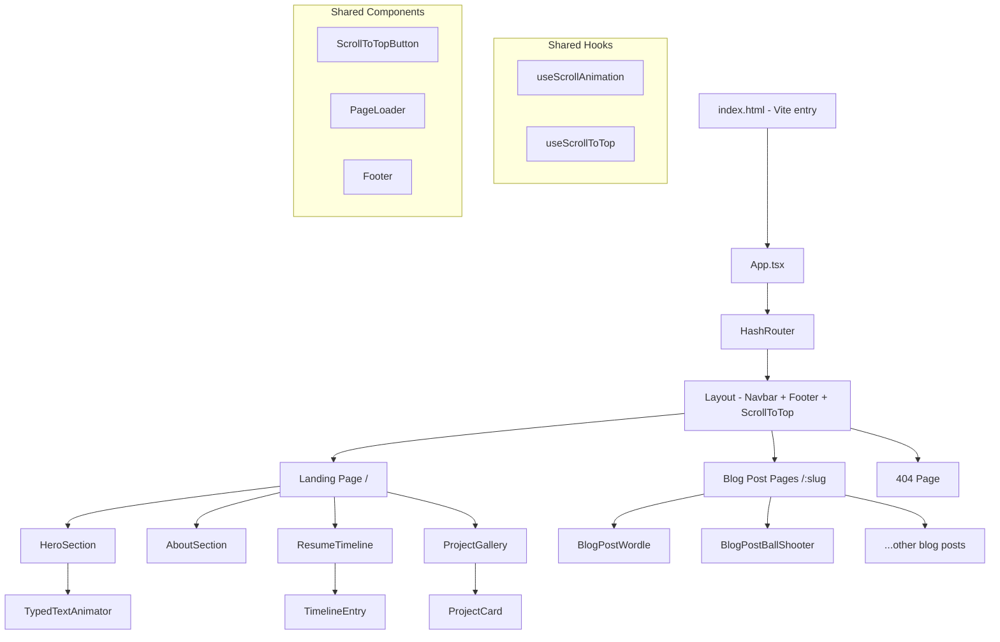

# Design Document: React Portfolio Migration

## Overview

This design describes the migration of henrylam.blog from a static HTML/CSS/jQuery site to a React single-page application (SPA). The React app will be bootstrapped with Vite (for fast builds and modern tooling), use React Router for client-side navigation, and deploy to GitHub Pages with the existing custom domain. The visual design, content, and interactive features will be preserved pixel-for-pixel, with jQuery-based animations replaced by React-compatible alternatives using Intersection Observer API and CSS transitions.

### Key Design Decisions

1. **Vite over CRA**: Vite offers faster dev builds, smaller bundles, and is the modern standard. CRA is deprecated.
2. **HashRouter**: GitHub Pages doesn't support server-side rewrites, so `HashRouter` avoids 404s on direct URL access.
3. **Intersection Observer over jQuery Waypoints**: Native browser API, no dependencies, React-friendly via custom hooks.
4. **CSS Modules or plain CSS**: Keep existing CSS largely intact, imported as global styles, to minimize visual regression risk.
5. **Static blog content as React components**: Each blog post becomes a React component rather than fetching markdown, preserving the existing HTML structure (tables, embedded videos, Chart.js, etc.) with minimal transformation.

## Architecture



### Routing Structure

| Route | Component | Description |
|-------|-----------|-------------|
| `/#/` | `LandingPage` | Main page with Hero, About, Resume, Projects |
| `/#/wordle-solver` | `WordleSolver` | Blog post page |
| `/#/immersive-ball-shooter` | `ImmersiveBallShooter` | Blog post page |
| `/#/colorization-of-grayscale-images` | `ColorizationOfGrayscaleImages` | Blog post page |
| `/#/maze-game-implementing-bfs-algorithm` | `MazeGameBfs` | Blog post page |
| `/#/assembling-iphone-from-parts` | `AssemblingIphone` | Blog post page |
| `/#/distinguishing-people-with-masks` | `DistinguishingMasks` | Blog post page |
| `/#/robot-controlled-vehicle` | `RobotControlledVehicle` | Blog post page |
| `/#/3d-box-shooter-game` | `BoxShooterGame` | Blog post page |
| `/#/roller-madness` | `RollerMadness` | Blog post page |
| `/#/carbon-credit-tokenization` | `CarbonCreditTokenization` | Blog post page |
| `*` | `NotFoundPage` | 404 fallback |

## Components and Interfaces

### App Component
```
App
├── PageLoader (shows loading spinner, fades out on mount)
├── HashRouter
│   └── Layout
│       ├── Navbar (fixed top, context-aware styling)
│       ├── Routes
│       │   ├── "/" → LandingPage
│       │   ├── "/:slug" → BlogPostPage (dynamic)
│       │   └── "*" → NotFoundPage
│       ├── Footer
│       └── ScrollToTopButton
```

### Component Interfaces

```typescript
// Navbar
interface NavbarProps {
  variant: 'landing' | 'blog'; // Controls color scheme
}

// TypedTextAnimator
interface TypedTextAnimatorProps {
  strings: string[];       // List of descriptors to cycle through
  typingSpeed: number;     // ms per character typing (150)
  erasingSpeed: number;    // ms per character erasing (75)
  pauseDuration: number;   // ms pause after typing complete (1000)
}

// TimelineEntry
interface TimelineEntryProps {
  title: string;
  organization: string;
  dateRange: string;
  icon: 'graduation' | 'suitcase';
  inverted: boolean;       // Controls left/right alternation
}

// ProjectCard
interface ProjectCardProps {
  title: string;
  description: string;
  image: string;
  slug: string;            // Route path for navigation
}

// ScrollToTopButton (no props, uses scroll position internally)

// useScrollAnimation hook
function useScrollAnimation(options?: {
  threshold?: number;      // Default 0.15 (maps to ~85% offset)
  staggerDelay?: number;   // Default 100ms
}): React.RefObject<HTMLElement>;
```

### Shared Custom Hooks

**useScrollAnimation**: Wraps Intersection Observer to trigger CSS class additions when elements enter the viewport. Replaces jQuery Waypoints.

```typescript
// Usage in components:
function AnimateBox({ children, effect = 'fadeInUp' }) {
  const ref = useScrollAnimation();
  return (
    <div ref={ref} className="animate-box" data-animate-effect={effect}>
      {children}
    </div>
  );
}
```

**useScrollToTop**: Monitors scroll position, returns `isVisible` boolean for the go-to-top button. Provides `scrollToTop()` function.

**useNavbarVariant**: Determines navbar color variant based on current route (landing vs blog post).

### Blog Post Component Pattern

Each blog post is a standalone React component that contains the HTML content from the original page. This approach was chosen over markdown because the posts contain complex elements (Chart.js scripts, YouTube embeds, custom tables, inline styles).

```typescript
// Example: src/pages/blog/WordleSolver.tsx
function WordleSolver() {
  return (
    <BlogPostLayout>
      <h1>Unraveling the Mechanics of Wordle...</h1>
      <p>Brain teaser games have always...</p>
      {/* Content migrated from wordle-solver.html */}
      <RelatedProjects slugs={['immersive-ball-shooter', 'maze-game-implementing-bfs-algorithm']} />
    </BlogPostLayout>
  );
}
```

**BlogPostLayout**: Wrapper component that provides consistent blog post styling (the `.main-container` and `#main-text` structure from the original site).

## Data Models

### Project Data

```typescript
interface Project {
  slug: string;           // URL-friendly identifier, e.g. "wordle-solver"
  title: string;          // Display title, e.g. "Wordle Solver"
  description: string;    // Short description for overlay, e.g. "Greedy Search Algorithm"
  image: string;          // Path to thumbnail image
}

// Centralized project data array
const projects: Project[] = [
  { slug: 'wordle-solver', title: 'Wordle Solver', description: 'Greedy Search Algorithm', image: '/images/wordle.jpg' },
  { slug: 'immersive-ball-shooter', title: 'Immersive Ball Shooter', description: 'Apple Vision Pro', image: '/images/ball_shooter.png' },
  // ... all 10 projects
];
```

### Resume Data

```typescript
interface TimelineItem {
  type: 'education' | 'work';
  title: string;
  organization: string;
  dateRange: string;
  description?: string;
}

const timelineData: TimelineItem[] = [
  { type: 'education', title: 'Computer Science and Artificial Intelligence', organization: 'Hong Kong University of Science and Technology', dateRange: '09/2021 - Present' },
  // ... updated from Resume.docx
];
```

### Typed Text Descriptors

```typescript
const descriptors: string[] = [
  'Computer Science Major',
  'Programmer',
  'Gamer',
  'Tech Enthusiast',
  'Innovative Thinker',
  'Problem Solver',
  'Team Player',
  'Artificial Intelligence Scholar',
  // ... all 20 descriptors
];
```


## Correctness Properties

*A property is a characteristic or behavior that should hold true across all valid executions of a system — essentially, a formal statement about what the system should do. Properties serve as the bridge between human-readable specifications and machine-verifiable correctness guarantees.*

### Property 1: Typed text state machine produces correct character sequence

*For any* list of descriptor strings and any point in the animation cycle, the displayed text should be a substring of the current descriptor — either a progressively longer prefix (typing phase) or a progressively shorter prefix (erasing phase) — and the animator should never display characters not belonging to the current descriptor.

**Validates: Requirements 3.3**

### Property 2: Shuffle preserves all elements

*For any* array of descriptor strings, shuffling the array should produce a result that contains exactly the same elements as the original (same length, same multiset of values), just in a potentially different order.

**Validates: Requirements 3.4**

### Property 3: Timeline entry renders complete and correct data

*For any* timeline entry with a type (education or work), title, organization, and date range, the rendered output should contain the title text, organization text, date range text, alternate between inverted and non-inverted layout positions, and display a graduation cap icon for education entries or a suitcase icon for work entries.

**Validates: Requirements 5.1, 5.2, 5.3**

### Property 4: Project card links to correct route

*For any* project data object with a slug, the rendered ProjectCard component should produce a link element whose href contains the project's slug, ensuring navigation to the correct blog post page.

**Validates: Requirements 6.3**

### Property 5: Related projects section contains valid links

*For any* blog post page with a list of related project slugs, the rendered RelatedProjects component should contain a link for each slug, and each link's href should contain the corresponding slug.

**Validates: Requirements 7.3**

### Property 6: Scroll animation applies correct effect class with stagger

*For any* group of N sibling elements with configured animation effects (fadeIn, fadeInLeft, fadeInRight, fadeInUp), when the intersection callback fires, element at index k should receive its configured animation CSS class after a delay of k × 100ms.

**Validates: Requirements 8.2, 8.3**

### Property 7: Scroll animation is idempotent

*For any* element that has already been animated, triggering the intersection callback again should not re-add or re-trigger the animation class. The element should retain its `animated-fast` class and not be processed again.

**Validates: Requirements 8.4**

### Property 8: Router maps all known slugs to components

*For any* slug in the known set of blog post slugs, the router configuration should map that slug to a valid React component, ensuring no slug results in a 404 when it should resolve to a blog post.

**Validates: Requirements 9.4**

## Error Handling

| Scenario | Handling Strategy |
|----------|-------------------|
| Unknown route accessed | Display NotFoundPage with link back to landing page |
| Image fails to load | Use `alt` text fallback (already in HTML); optionally add `onError` handler for broken image placeholder |
| Google Analytics blocked | GA script loads async; site functions normally without it |
| Hash navigation to section that doesn't exist | Scroll to top of page as fallback |
| Blog post component fails to render | React Error Boundary wraps blog post routes, shows fallback UI |
| Intersection Observer not supported | Fallback: show all elements immediately (no animation). Check `window.IntersectionObserver` existence. |

## Testing Strategy

### Testing Framework

- **Unit & Component Tests**: Vitest + React Testing Library
- **Property-Based Tests**: fast-check (JavaScript PBT library, integrates with Vitest)
- **Minimum iterations**: 100 per property test

### Unit Tests

Unit tests cover specific examples, edge cases, and integration points:

- Navbar renders correct links and brand name
- Navbar variant switches between landing/blog styles based on route
- Landing page renders all four sections (Hero, About, Resume, Projects)
- Each blog post route renders without crashing
- 404 page renders for unknown routes
- Footer contains copyright text and henrylam.blog link
- CNAME file exists in public directory with correct content
- Google Analytics script tag present with correct ID
- Favicon files present in public directory
- Resume data contains all expected education and work entries

### Property-Based Tests

Each property test references a design property and runs a minimum of 100 iterations.

| Property | Test Description | Tag |
|----------|-----------------|-----|
| Property 1 | Generate random descriptor lists, verify typing/erasing state machine | Feature: react-portfolio-migration, Property 1: Typed text state machine |
| Property 2 | Generate random string arrays, verify shuffle preserves elements | Feature: react-portfolio-migration, Property 2: Shuffle preserves elements |
| Property 3 | Generate random timeline entries, verify rendered output completeness | Feature: react-portfolio-migration, Property 3: Timeline entry rendering |
| Property 4 | Generate random project data, verify link href contains slug | Feature: react-portfolio-migration, Property 4: Project card links |
| Property 5 | Generate random slug lists, verify RelatedProjects links | Feature: react-portfolio-migration, Property 5: Related projects links |
| Property 6 | Generate random element groups with effects, verify class application with stagger | Feature: react-portfolio-migration, Property 6: Scroll animation stagger |
| Property 7 | Generate animated elements, trigger callback twice, verify no re-animation | Feature: react-portfolio-migration, Property 7: Scroll animation idempotence |
| Property 8 | For all known slugs, verify router resolves to a component | Feature: react-portfolio-migration, Property 8: Router slug mapping |
